<p align="center">

</p>

<h3 align="center">
Universidad de Buenos Aires<br>
Facultad de Ingeniería
</h3>

<p align="center">
Taller de Sistemas Embebidos<br>
Trabajo Práctico Final
</p>

---

<h1 align="center">Sleep Centinel</h1>

<p align="center">

</p>

<p align="center">
Sistema de detección de apneas y variaciones de oxigenación durante el sueño
</p>

---

**FECHA:** 4/03/2026  

<br>

**ESTUDIANTES**

Tomás Musso Carboni  
`tmusso@fi.uba.ar`

Alan Romero
`alromero@fi.uba.ar`

Santiago Archetti  
`sarchetti@fi.uba.ar`

<div align="center">

# RESUMEN

Este trabajo describe el desarrollo de Sleep Centinel, un sistema embebido portátil de bajo costo diseñado para el monitoreo continuo de parámetros fisiológicos durante el sueño. El dispositivo integra un microcontrolador de la familia STM32 y un sensor óptico para detectar de forma inalámbrica apneas y variaciones de oxigenación en el paciente. Este proyecto resulta de gran importancia debido a que los trastornos respiratorios del sueño suelen estar subdiagnosticados y requieren equipos costosos, por lo que una alternativa accesible facilita el seguimiento preventivo y ambulatorio.

El diseño demuestra la aplicación de los conocimientos adquiridos en la carrera mediante la integración de hardware de bajo consumo y el desarrollo de un firmware basado en máquinas de estado. Se implementaron algoritmos de procesamiento digital de señales para la extracción de datos y se incorporó comunicación Bluetooth para la transmisión inalámbrica. Asimismo, se realizó un análisis del rendimiento del sistema, evaluando métricas fundamentales como el consumo energético, el uso de memoria y la carga del procesador central.

A lo largo de esta memoria, el lector encontrará un análisis detallado de los requerimientos y la selección de componentes de hardware. Posteriormente, se describen la arquitectura del firmware y el diseño de la placa de circuito impreso, finalizando con la presentación de los ensayos funcionales y las conclusiones obtenidas a partir de la evaluación global del prototipo.

<br>

# ABSTRACT

This work describes the development of Sleep Centinel, a low-cost portable embedded system designed for the continuous monitoring of physiological parameters during sleep. The device integrates an STM32 family microcontroller and an optical sensor to wirelessly detect apneas and oxygenation variations in the patient. This project is of great importance because sleep-related breathing disorders are often underdiagnosed and require expensive equipment; therefore, an accessible alternative facilitates preventive and ambulatory follow-up.

The design demonstrates the application of the knowledge acquired throughout the degree through the integration of low-power hardware and the development of firmware based on state machines. Digital signal processing algorithms were implemented for data extraction, and Bluetooth communication was incorporated for wireless transmission. Likewise, a system performance analysis was conducted, evaluating fundamental metrics such as power consumption, memory usage, and central processor load.

Throughout this report, the reader will find a detailed analysis of the requirements and the selection of hardware components. Subsequently, the firmware architecture and the printed circuit board design are described, concluding with the presentation of functional tests and the conclusions obtained from the global evaluation of the prototype.

</div>

# Índice


- [1. Introducción general](#1-introducción-general)
  - [1.1 Sistema de detección de apneas y variaciones de oxigenación durante el sueño](#11-sistema-de-detección-de-apneas-y-variaciones-de-oxigenación-durante-el-sueño)

- [2. Introducción específica](#2-introducción-específica)
  - [2.1 Descripción del equipo](#21-descripción-del-equipo)
  - [2.2 Estado del arte](#22-estado-del-arte)
  - [2.3 Requerimientos funcionales](#23-requerimientos-funcionales)
  - [2.4 Casos de uso](#24-casos-de-uso)
  - [2.5 Descripción de módulos externos utilizados](#25-descripción-de-módulos-externos-utilizados)
    - [2.5.1 Display LCD 16x2](#251-display-lcd-16x2)
    - [2.5.2 Módulo Bluetooth HM-10](#252-hm-10)
    - [2.5.3 Sensor MAX30102](#253-max30102)

- [3. Diseño e Implementación](#3-diseño-e-implementación)
  - [3.1 Hardware del sistema](#31-hardware-del-sistema)
    - [3.1.1 Comparación de módulos Bluetooth](#311-comparación-de-módulos-bluetooth)
    - [3.1.2 Comparación de sensores](#312-comparación-de-sensores)
    - [3.1.3 Conexiones del sistema](#313-conexiones-del-sistema)
    - [3.1.4 Costo de componentes](#314-costo-de-componentes)
  - [3.2 Firmware](#32-firmware)
    - [3.2.1 Arquitectura general del firmware](#321-arquitectura-general-del-firmware)
    - [3.2.2 Módulo Sensor](#322-módulo-sensor)
    - [3.2.3 Módulo Actuador](#323-módulo-actuador)
    - [3.2.4 Módulo de botones](#324-módulo-botones)
    - [3.2.5 Módulo de sistema](#325-módulo-sistema)
  - [3.3 Diseño de la placa](#33-diseño-de-la-placa)

- [4. Ensayos y resultados](#4-ensayos-y-resultados)
  - [4.1 Pruebas funcionales del hardware](#41-pruebas-funcionales-del-hardware)
    - [4.1.1 Metodología de ensayo](#411-metodología-de-ensayo)
    - [4.1.2 Resultados obtenidos](#412-resultados-obtenidos)
    - [4.1.3 Análisis de resultados](#413-análisis-de-resultados)
  - [4.2 Pruebas funcionales del firmware](#42-pruebas-funcionales-del-firmware)
    - [4.2.1 Metodología de ensayo](#421-metodología-de-ensayo)
    - [4.2.2 Resultados obtenidos](#422-resultados-obtenidos)
    - [4.2.3 Análisis de resultados](#423-análisis-de-resultados)
  - [4.3 Pruebas de integración](#43-pruebas-de-integración)
  - [4.4 Cumplimiento de requisitos](#44-cumplimiento-de-requisitos)
  - [4.5 Medición y análisis de consumo](#45-medición-y-análisis-de-consumo)
    - [4.5.1 Procedimiento realizado](#451-procedimiento-realizado)
    - [4.5.2 Modos de operación medidos](#452-modos-de-operación-medidos)
    - [4.5.3 Alcance de la medición](#453-alcance-de-la-medición)
  - [4.6 Medición y análisis de tiempos de ejecución (WCET)](#46-medición-y-análisis-de-tiempos-de-ejecución-wcet)
    - [4.6.1 Metodología aplicada](#461-metodología-aplicada)
    - [4.6.2 Tareas analizadas](#462-tareas-analizadas)
    - [4.6.3 Resultados de medición](#463-resultados-de-medición)
  - [4.7 Cálculo del factor de uso de la CPU](#47-cálculo-del-factor-de-Uso-(U)-de-la-CPU)
    - [4.7.1 Método de cálculo](#471-método-de-cálculo)
    - [4.7.2 Interpretación del resultado](#472-interpretación-del-resultado)
  - [4.8 Console & Build Analyzer](#48-console--build-analyzer)
  - [4.9 Documentación del desarrollo realizado](#49-documentación-del-desarrollo-realizado)

- [5. Conclusiones](#5-conclusiones)
  - [5.1 Resultados](#51-resultados)
  - [5.2 Próximos pasos](#52-próximos-pasos)

- [Referencias](#referencias)
- [Apéndice A: Video](#video)

---

# Índice de Figuras

Figura 2.1 Funcionamiento del sensor MAX30102  
Figura 2.2 Oxímetro de pulso  

Figura 2.3 Módulo LCD 1602A utilizado  
Figura 2.4 Módulo Bluetooth HM-10  
Figura 2.5 Sensor óptico MAX30102  

Figura 3.1 Vista explotada de la placa utilizada  
Figura 3.2 Conexión de los LEDs  

Figura 3.3 Diagrama de módulos de software  
Figura 3.4 Diagrama de archivos .h y .c  
Figura 3.5 Máquina de estados del sistema  
Figura 3.6 Máquina de estados del sensor  
Figura 3.7 Máquina de estados de los botones  
Figura 3.8 Máquina de estados del actuador  

Figura 3.10 Diseño de la PCB en KiCad  
Figura 3.11 Previsualización 3D de la placa  

Figura 4.1 LED indicadores en funcionamiento  
Figura 4.2 Tensión del sensor MAX30102  
Figura 4.3 Parámetros fisiológicos vistos desde el debugger  
Figura 4.4 Conexión Bluetooth exitosa  
Figura 4.5 Datos fisiológicos enviados por Bluetooth  
Figura 4.6 Datos fisiológicos mostrados en el display  
Figura 4.7 Captura de memoria del sistema  
Figura 4.8 Captura del compilador

---

# Índice de Tablas

Tabla 2.1 Comparación de trabajos similares  
Tabla 2.2 Requerimientos funcionales  

Tabla 3.1 Evaluación de criterios del proyecto  
Tabla 3.2 Comparación de módulos Bluetooth  
Tabla 3.3 Comparación de sensores  

Tabla 3.4 Conexiones del display  
Tabla 3.5 Conexiones del sensor MAX30102  
Tabla 3.6 Conexiones del módulo HM-10  
Tabla 3.7 Conexión del buzzer  
Tabla 3.8 Conexiones de los botones  

Tabla 3.9 Caídas de tensión típicas para LEDs  
Tabla 3.10 Conexiones de los LEDs  
Tabla 3.11 Costo de los componentes  
Tabla 3.12: Función de cada módulo de software

Tabla 4.1 Pruebas funcionales de hardware  
Tabla 4.2 Pruebas funcionales de firmware  
Tabla 4.3 Pruebas de integración  
Tabla 4.4 Cumplimiento de requerimientos funcionales  

Tabla 4.5 Consumo del sistema en distintos modos  
Tabla 4.6 Tareas analizadas para WCET  
Tabla 4.7 Tiempos de ejecución medidos  

Tabla 4.8 Resumen de elementos del proyecto

---

# 1 Introducción general

## 1.1 Sistema de detección de apneas y variaciones de oxigenación durante el Sueño

Los trastornos respiratorios durante el sueño, como la apnea obstructiva, representan una problemática de salud creciente que afecta la calidad de vida y aumenta el riesgo cardiovascular de quienes los padecen. El presente trabajo surge de la necesidad de contar con dispositivos de monitoreo continuo que sean accesibles y de uso domiciliario, permitiendo una detección temprana de episodios de desaturación de oxígeno sin la complejidad ni los costos de los estudios clínicos tradicionales. La motivación principal es brindar una herramienta portátil e inalámbrica que facilite el seguimiento ambulatorio y preventivo del paciente.

El presente trabajo se destaca especialmente por incorporar el procesamiento digital de señales en tiempo real dentro de un sistema embebido de bajo consumo.
El desafío técnico de este trabajo consistió en integrar sensores de alta precisión con algoritmos de filtrado eficientes, aplicando los conceptos de arquitectura de firmware y gestión de recursos aprendidos durante la carrera.

A continuación, se presenta un diagrama en bloques general que describe la interacción de los componentes del sistema, los cuales se detallan en mayor profundidad en la sección [3](#3-diseño-e-implementación)

Para cumplir con los objetivos planteados, el sistema desarrollado cuenta con las siguientes características principales:

-   Una placa con microcontrolador *STM32 F103RB*, encargada de la
    adquisición, procesamiento digital de señales y control general del
    sistema.

-   Un sensor óptico *MAX30102*, que permite medir señales PPG mediante
    leds rojo e infrarrojo para el cálculo de $SpO_{2}$ y la estimación
    de la frecuencia respiratoria.

-   Un módulo de comunicación Bluetooth *HM-10*, que posibilita la
    transmisión inalámbrica de los datos hacia un dispositivo móvil para
    su visualización en tiempo real.

-   Un display, que muestra datos por pantalla en tiempo real.

-   Un sistema de alarmas locales compuesto por un buzzer y leds
    indicadores, que alertan al usuario ante condiciones críticas de
    saturación de oxígeno.

-   Procesamiento digital de la señal implementado en lenguaje C.

-   Lógica de control que activa alarmas cuando la saturación de oxígeno
    cae por debajo de los umbrales configurados.

-   Modos de funcionamiento configurables (modo adulto, modo niño).

<p align="center">
  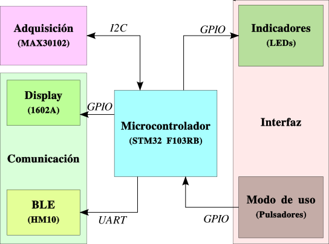
</p>
<p align="center">
  <em>Figura 1.1: Diagrama de bloques general.</em>
</p>


# 2 Introducción específica

## 2.1 Descripción del equipo

El dispositivo dispone de dos botones, uno de los cuales permite seleccionar el modo de funcionamiento. Esta configuración es necesaria debido a que los valores normales de saturación de oxígeno en sangre, frecuencia respiratoria y frecuencia cardíaca difieren según la edad del usuario. Con esta consideración, se cuentan 2 modos de funcionamiento: adulto o niño. Una vez establecidos los parámetros correspondientes al modo seleccionado, el sensor óptico MAX30102 se coloca en el dedo del usuario.

<p align="center">
  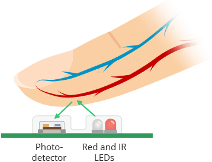
  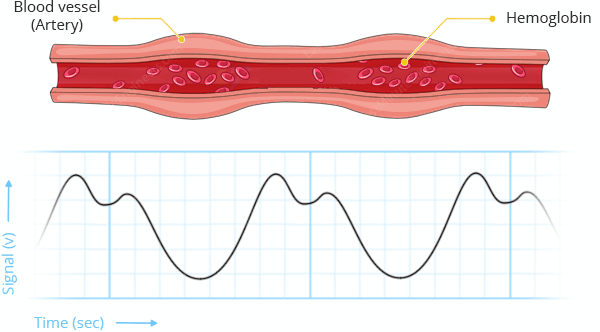
</p>

<p align="center">
  <em>Figura 2.1: Funcionamiento del sensor MAX30102.</em>
</p>

Este sensor se utiliza para la medición de señales de fotopletismografía (PPG). El mismo integra dos fuentes de luz LED (una roja y una infrarroja), un fotodiodo y un sistema de conversión analógico-digital. Debido a que el volumen de sangre en los vasos varía con cada latido cardíaco, la cantidad de luz absorbida también cambia de forma periódica. Las variaciones de luz absorbida son captadas por el fotodiodo del sensor, el cual convierte la intensidad de la luz reflejada en una señal eléctrica. Los valores digitalizados corresponden a las mediciones de luz detectada por los LEDs rojo e infrarrojo, los cuales constituyen la señal PPG. Estos datos son transmitidos al microcontrolador mediante I²C. Posteriormente, las señales adquiridas son sometidas a una etapa de procesamiento digital, en la cual se aplican los algoritmos necesarios para calcular los valores de saturación de oxígeno en sangre, frecuencia cardíaca y frecuencia respiratoria.

Para la estimación de la frecuencia cardíaca, se utiliza principalmente la señal PPG infrarroja. Se aplica un filtrado pasa-banda en el rango aproximado de 0,5 a 5 Hz, con el objetivo de eliminar ruidos para posteriormente detectar los máximos locales de la señal filtrada, que corresponden a latidos válidos. A partir del intervalo temporal entre picos consecutivos, se calcula la frecuencia cardíaca en latidos por minuto. En el caso de la saturación de oxígeno en sangre ($SpO_{2}$), se utilizan ambas señales PPG. Cada una de estas señales se descompone en dos componentes: una componente continua (DC) y una componente alterna (AC). A partir de estas componentes se calcula una relación entre las señales roja e infrarroja:

$$R = \frac{\frac{AC_{RED}}{DC_{RED}}}{\frac{AC_{IR}}{DC_{IR}}}$$

$$SpO_{2} \approx 110 - 25*R$$

Por último, la frecuencia respiratoria puede estimarse analizando las oscilaciones de baja frecuencia presentes en la señal infrarroja. Se aplica un filtro pasa-bajos con una frecuencia cercana a 0,4 Hz. Finalmente, mediante la detección de picos o el análisis de la frecuencia dominante de la señal filtrada, se obtiene el número de ciclos respiratorios por minuto. Luego de la etapa de procesamiento, y considerando los rangos previamente establecidos según el modo de funcionamiento seleccionado, el sistema transmite en tiempo real la información obtenida tanto al display como a un dispositivo móvil en caso de haberse establecido la conexión mediante Bluetooth. Los datos transmitidos incluyen:

- Detección de apnea (presencia o ausencia).
- Frecuencia respiratoria actual.
- Frecuencia cardíaca actual.
- Saturación de oxígeno en sangre actual.

En caso de que la oxigenación en sangre descienda por debajo de los límites considerados peligrosos durante cierto tiempo, el sistema detecta una apnea activa el buzzer y un LED para alertar al usuario. Esta alarma puede desactivarse manualmente mediante el botón de apagado correspondiente. Asimismo, si no se detecta contacto del usuario con el sensor durante un período prolongado de tiempo, el sistema retorna a su estado de reposo a la espera de una nueva medición.

## 2.2 Estado del arte

La inspiración para el desarrollo de este proyecto se basa en el
funcionamiento de un oxímetro de pulso, el cual utiliza señales PPG
obtenidas mediante la emisión de luz roja e infrarroja para estimar la
saturación de oxígeno en sangre. Tomando como referencia este principio
de funcionamiento, el presente proyecto propone extender sus
capacidades, con el objetivo de desarrollar un sistema de monitoreo
completo durante el sueño. Además de estimar la saturación de
oxígeno, permite obtener y supervisar otros parámetros fisiológicos
relevantes, como la frecuencia cardíaca, la frecuencia respiratoria y la
detección de episodios de apnea, proporcionando así una herramienta más
completa para el seguimiento del estado fisiológico del usuario durante
el descanso.

<p align="center">
  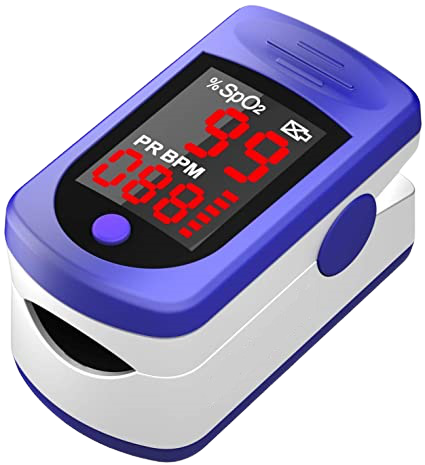
</p>

<p align="center">
  <em>Figura 2.2: Oxímetro de pulso.</em>
</p>

**Tabla 2.1 Comparación de trabajos similares**

| **Características** | **Sleep Centinel (Dispositivo del proyecto)** | **Oxímetro de pulso tradicional** |
|---------------------|-----------------------------------------------|------------------------------------|
| Parámetros medidos | Saturación de oxígeno en sangre (SpO₂), frecuencia cardíaca y estimación del patrón respiratorio durante el sueño | Saturación de oxígeno en sangre (SpO₂) y frecuencia cardíaca |
| Método de medición | Sensor óptico MAX30102 integrado en un sistema embebido con procesamiento de señal | Sensor óptico basado en fotopletismografía integrado en una pinza para el dedo |
| Duración de la monitorización | Diseñado para monitorización continua durante el sueño | Normalmente utilizado para mediciones puntuales de corta duración |
| Procesamiento de datos | Procesamiento de señal en el sistema embebido mediante ventanas de muestreo y filtrado | Procesamiento interno básico para mostrar valores instantáneos |
| Interfaz de usuario | Pantalla LCD que muestra los datos fisiológicos y el estado del sistema | Pequeña pantalla integrada que muestra SpO₂ y frecuencia cardíaca |
| Almacenamiento de datos | Uso de memoria RAM para almacenamiento temporal de muestras | Generalmente no dispone de almacenamiento interno |
| Conectividad | Comunicación inalámbrica mediante Bluetooth para transmisión de datos a dispositivos externos | Normalmente dispositivo autónomo con conectividad limitada o inexistente |
| Alimentación | Sistema embebido alimentado mediante fuente de alimentación del microcontrolador | Batería recargable interna o pilas AAA |
| Sensores | Sensor óptico MAX30102 para adquisición de señales fisiológicas | Sensor óptico integrado para medición de SpO₂ |
| Uso previsto | Monitorización continua del sueño y análisis de señales fisiológicas | Comprobación rápida del nivel de oxígeno y pulso |
| Precio | Prototipo de investigación (sin precio comercial) | Aproximadamente entre 20 y 50 USD según el modelo |


## 2.3 Requerimientos funcionales


**Table 2.2: Requerimientos funcionales**

| Grupo | ID | Requerimiento Funcional | Descripción |
|---|---|---|---|
| Adquisición | 1.1 | Adquisición de señales | Capturar señales ópticas ROJO/IR del MAX30102 vía I²C. |
| Adquisición | 1.2 | Lectura periódica | Obtener muestras desde la FIFO del sensor. |
| Adquisición | 1.3 | Análisis de variación | Detectar variaciones relevantes para el cálculo de SpO₂ y respiración. |
| Procesamiento | 2.1 | Filtrado digital | Aplicar filtrado digital para reducir ruido en la señal PPG. |
| Procesamiento | 2.2 | Cálculo de SpO₂ | Calcular SpO₂ mediante el método del ratio R. |
| Procesamiento | 2.3 | Cálculo de respiración | Estimar la frecuencia respiratoria mediante análisis de envolvente o variaciones de línea base. |
| Procesamiento | 2.4 | Empaquetado de datos | Generar paquetes de datos con SpO₂, respiración y estado del sistema. |
| Indicadores | 3.1 | Alarma crítica | Activar alarma sonora cuando se detecta apnea. |
| Indicadores | 3.2 | Indicadores LED | Mostrar estados (crítico, normal, error) mediante LEDs. |
| Comunicación | 4.1 | Bluetooth | Transmitir datos vía HM-10 utilizando UART. |
| Comunicación | 4.2 | Envío de parámetros | Enviar SpO₂, respiración y estado del paciente a la aplicación. |
| Comunicación | 4.3 | Registro de eventos | Informar alarmas, desconexiones o estados especiales. |
| Comunicación | 4.4 | Elección de umbrales | Recibir umbrales y parámetros desde la aplicación. |
| Comunicación | 4.4 | Display | Mostrar parámetros fisiológicos relevantes en pantalla. |
| Memoria | 5.1 | Guardar configuración | Almacenar umbrales y parámetros en EEPROM. |
| Memoria | 5.2 | Restaurar valores | Recuperar valores predeterminados si hay error de memoria. |
| Alimentación | 6.1 | Alimentación | Alimentación del sistema mediante conexión USB. |
| Alimentación | 6.2 | Bajo consumo | Entrar en modo Sleep cuando no hay actividad. |
| Alimentación | 6.3 | Reactivación | Retomar actividad ante interrupciones o comandos. |


## 2.4 Casos de uso
Con respecto a los casos de uso, se pueden mencionar los siguientes:

El sistema cuenta con dos modos de funcionamiento: KID y ADULT, cada uno de los cuales establece parámetros específicos según el tipo de usuario.


Rangos de parámetros del modo KID: 


- Frecuencia cardíaca: {90,120}

- Frecuencia respiratoria: {15,30}


Rangos de parámetros del modo ADULT:

- Frecuencia cardíaca: {45,90}
- Frecuencia respiratoria : {10,20}

En ambos casos el límite para la saturación de oxígeno en sangre es $SP02_{LOW} = 80$.
Cabe destacar que el sistema puede utilizarse tanto con conexión Bluetooth como sin ella. Cuando la conexión está activa, los datos se envían al dispositivo móvil y, simultáneamente, se visualizan en la pantalla del sistema. En cambio, cuando no se establece la conexión, la información se muestra únicamente en la pantalla del display.

## 2.5 Descripción de módulos externos utilizados

-   Display LCD 16x2

-   Sensor MAX30102

-   Módulo Bluetooth HM-10

### 2.5.1 Display LCD 16x2

El display utilizado es un display LCD de 16x2 como se puede observar en
la [Figura 2.3](#fig-lcd).
Dichas conexiones se realizaron con una configuración de 4 bits. El
mismo efectúa la comunicación con la placa mediante pines *GPIO*.

<p align="center">
  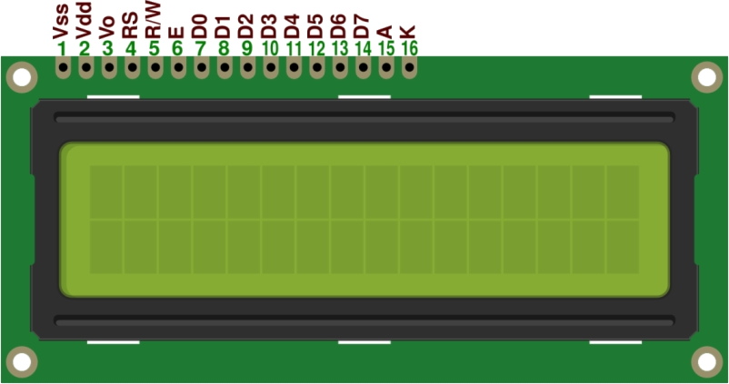
</p>

<p align="center">
  <em>Figura 2.3: Módulo LCD 1602A utilizado.</em>
</p>

### 2.5.2 HM-10

Para la transmisión de los datos hacia el dispositivo móvil del usuario
se emplea un módulo Bluetooth HM-10. La comunicación entre el módulo
Bluetooth y la placa de desarrollo se realiza usando la interfaz UART. A
través de esta interfaz serie, el microcontrolador transmite al módulo
los parámetros de interés para su posterior envío al dispositivo móvil
del usuario.

<p align="center">
  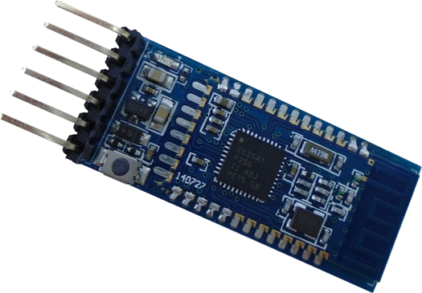
</p>

<p align="center">
  <em>Figura 2.4: Módulo Bluetooth HM-10.</em>
</p>


### 2.5.3 MAX30102
El MAX30102 es un módulo sensor óptico.
En este proyecto, se encarga de adquirir la señal de fotopletismografía (PPG) directamente desde el dedo del usuario, la cual es fundamental para estimar la saturación de oxígeno en sangre (SpO₂), la frecuencia cardíaca y la frecuencia respiratoria. A diferencia del módulo Bluetooth, el sensor MAX30102 se comunica con el microcontrolador mediante el protocolo I²C, utilizando para ello las líneas de datos (SDA) y reloj (SCL), además de sus correspondientes pines de alimentación.

<p align="center">
  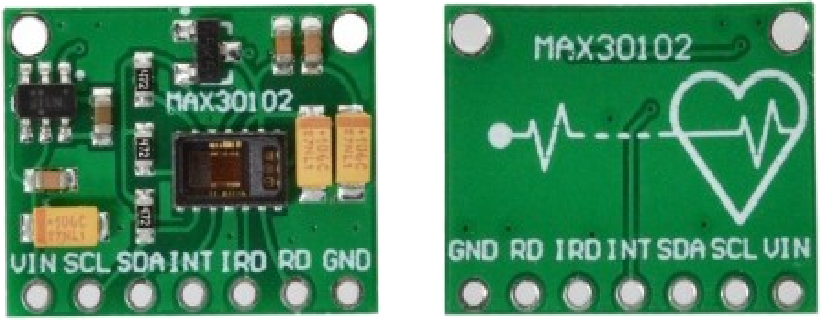
</p>
<p align="center">
  <em>Figura 2.5: Sensor óptico MAX30102.</em>
</p>


# 3 Diseño e Implementación
Este proyecto se eligió porque los problemas respiratorios durante el sueño, como la apnea, con muy comunes y muchas veces no se detectan a tiempo.
 La falta de diagnóstico puede generar cansancio crónico, bajo rendimiento y riesgos cardiovasculares, pero los estudios clínicos tradicionales 
, suelen ser costosos y difíciles de realizar en el hogar. Por eso, un dispositivo portátil que mida la respiración y la saturación de oxígeno 
durante la noche resulta una herramienta útil y accesible para identificar posibles alteraciones. 
Desde el punto de vista tecnológico, el proyecto es adecuado para el área de sistemas embebidos porque integra sensores reales, procesamiento digital, 
comunicación inalámbrica y manejo de bajo consumo. Además, el hardware seleccionado (MAX30102 y STM32F103RB) es económico, fácil de conseguir y cuenta 
con buena documentación, lo que facilita el desarrollo y permite enfocarse en el funcionamiento del sistema sin una complejidad excesiva. 
En conjunto, esto hace que el proyecto sea realizable, educativo y al mismo tiempo relevante desde lo biomédico. 
Para la elección del proyecto, se realiza un análisis profundo de los distintos criterios que lo componen, asignando un peso a cada uno de ellos para 
luego hacer un análisis total.

<p align="center"><b>Tabla 3.1: Evaluación de criterios del proyecto</b></p>

| Criterio                                             | Descripción                                                                                                                                                                                                                                                                                                                                                                                                                                                                                                 | Puntuación               | Peso final |
| ------------------------------------------------------| -------------------------------------------------------------------------------------------------------------------------------------------------------------------------------------------------------------------------------------------------------------------------------------------------------------------------------------------------------------------------------------------------------------------------------------------------------------------------------------------------------------| --------------------------| ------------|
| Tiempo y facilidad de implementación. Peso (7)       | El uso del sensor MAX30102 y el microcontrolador STM32F103RB presenta una complejidad moderada, debido a la necesidad de configurar correctamente la comunicación I²C, filtrar la señal PPG y aplicar algoritmos de cálculo de SpO₂ y frecuencia respiratoria. Sin embargo, existe amplia documentación y librerías disponibles, lo que reduce las dificultades de implementación. En conjunto, se considera que la complejidad técnica es manejable dentro del marco de un proyecto de sistemas embebidos. | <p align="center">7</p>  | 49         |
| Disponibilidad y costo de hardware. Peso (8)         | Los componentes principales —sensor óptico MAX30102, microcontrolador STM32, módulo Bluetooth y un buzzer/LED para alarmas— son económicos, fáciles de conseguir y ampliamente utilizados en proyectos biomédicos educativos. Esto permite realizar pruebas sin un costo elevado y garantiza buena disponibilidad de reemplazos.                                                                                                                                                                            | <p align="center">9</p>  | 72         |
| Facilidad de realización de pruebas. Peso (5)        | La verificación del funcionamiento del sistema puede realizarse mediante lectura directa de las señales PPG, monitoreo en tiempo real por UART/Bluetooth y observación de la activación de alarmas locales. Además, se pueden usar herramientas básicas como un multímetro o un osciloscopio para validar etapas eléctricas, lo que facilita enormemente el proceso de pruebas y depuración.                                                                                                                | <p align="center">7</p>  | 35         |
| Utilidad e interés personal en el proyecto. Peso (9) | El proyecto presenta un alto interés personal debido a su relación con aplicaciones biomédicas reales, la posibilidad de detectar apneas y desaturaciones durante el sueño, y su potencial mejora en versiones futuras. Además, permite aplicar conocimientos de sensores ópticos, filtrado digital y diseño embebido, lo que resulta atractivo tanto desde el punto de vista académico como práctico.                                                                                                      | <p align="center"> 9</p> | 81         |


## 3.1 Hardware del sistema

### 3.1.1 Comparación de módulos Bluetooth


**Tabla 3.2: Comparación de módulos Bluetooth.**

| Módulo      | Tecnología                     | Interface            | Precio unitario [USD] |
| -------------| --------------------------------| ----------------------| -----------------------|
| HM-10       | Bluetooth Low Energy (BLE 4.0) | UART (TX/RX)         | 4                     |
| HC-05       | Bluetooth 2.0 (Classic)        | UART (TX/RX)         | 3                     |
| ESP32 (BLE) | Bluetooth + WiFi               | UART, SPI, I2C, GPIO | 8,50                  |


El módulo **HM-10** fue seleccionado debido a que implementa el estándar **Bluetooth Low Energy (BLE)**, lo que permite establecer comunicación con dispositivos móviles modernos manteniendo un bajo consumo de energía. Cabe destacar su bajo costo, tamaño reducido y amplia disponibilidad.

---

### 3.1.2 Comparación de sensores

**Tabla 3.3: Comparación de sensores.**

| Sensor   | Tecnología                 | Interface | Precio unitario [USD] |
| ----------| ----------------------------| -----------| -----------------------|
| MAX30102 | PPG (Red + IR LED)         | I2C       | 5                     |
| MAX30100 | PPG (Red + IR LED)         | I2C       | 6                     |
| MAX30105 | PPG (IR + Particle sensor) | I2C       | 7                     |


Con respecto al sensor **MAX30102**, fue elegido debido a la recomendación de especialistas en el área, su tamaño compacto y su costo accesible, lo cual lo hace adecuado para este proyecto.

---
### 3.1.3 Conexiones del sistema

A continuación se muestra un diagrama de bloques del Hardware del equipo
y se explicá las conexiones para cada uno de los componentes.


<p align="center">
  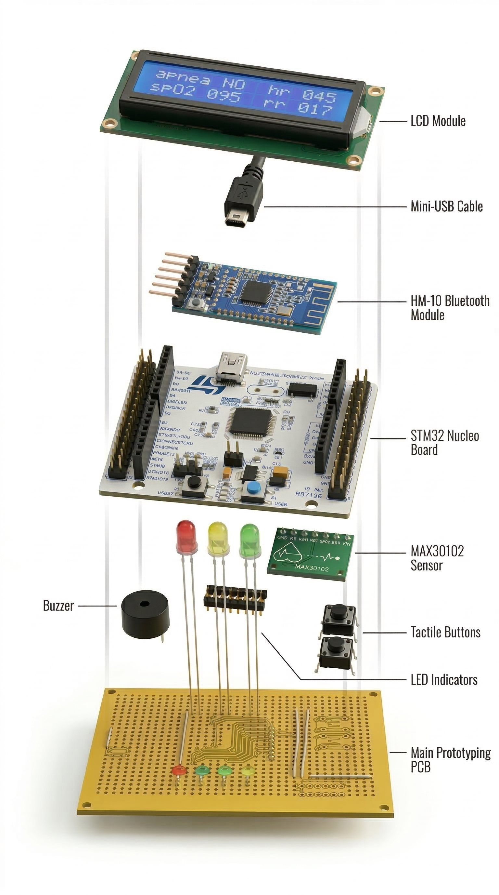
</p>
<p align="center">
  <em>Figura 3.1: Explotada de la placa utilizada.</em>
</p>

### Display LCD 16x2

**Tabla 3.4: Conexiones del display**

| Nucleo | Display |
| --------| ---------|
| 5 V     | VSS     |
| 5 V     | VDD     |
| B12    | RS      |
| GND    | RW      |
| A11    | E       |
| \-     | D0      |
| \-     | D1      |
| \-     | D2      |
| \-     | D3      |
| PB5    | D4      |
| PB4    | D5      |
| PB13   | D6      |
| PB14   | D7      |
| GND    | K       |


El pin A se conecta a 5 V a través de una resistencia de $1 k\Omega$
mientras que el pin _Vo_ se conecta a _5V_ y _GND_ a través de un
potenciometro de $100k\Omega$.

### Sensor MAX30102

**Tabla 3.5: Conexiones del MAX30102.**

| Nucleo | Sensor MAX30102 |
| --------| -----------------|
| GND    | GND             |
| 3,3 V   | VCC             |
| PB6    | SCL             |
| PB7    | SDA             |


### Módulo bluetooth HM-10

**Tabla 3.6: Conexiones del módulo HM-10.**

| Nucleo | HM-10 |
| --------| -------|
| GND    | GND   |
| 5 V     | VCC   |
| PA3    | TXD   |
| PA2    | RXD   |


### Buzzer

**Tabla 3.7: Conexion del Buzzer**

| Nucleo | Buzzer |
| --------| --------|
| GND    | \-     |
| PC7    | \+     |


### Botones

**Tabla 3.8: Conexiones de los botones.**

| Nucleo | BOTON       |
| --------| -------------|
| PC10   | SWITCH-MODE |
| PC11   | ALARM-OFF   |


Siendo SWITCH-MODE y ALARM-OFF los botones encargados de cambiar el modo
de uso y apagar la alarma respectivamente, ambos configurados en modo
pull-up y conectados a GND del otro extremo.

### LEDs

Para polarizar los LEDs con una fuente de 3,3 V, las resistencias
limitadoras se calculan mediante la siguiente fórmula:
$$R = \frac{V_{CC}- V_f}{I_f}$$

-   $V_{CC}$ la tensión de alimentación (en este caso 3,3 V).

-   $I_f$ la corriente deseada por el LED(normalmente se utiliza entre
    5 mA y 10 mA).

-   $V_f$ la tensión directa del LED.

Dado que se utilizan LEDs de diferentes colores el valor de $V_f$
dependerá de la caída de tensión típica según el color:

-   LED rojo $\longrightarrow$ indica estado de peligro junto con la
    alarma.

-   LED azul $\longrightarrow$ indica que la conexión bluetooth a sido
    exitosa.

-   LED verde $\longrightarrow$ modo adulto.

-   LED amarillo $\longrightarrow$ modo niño.

**Tabla 3.9: Caidas de tensión tipicas para LEDs.**

| Color LED | $V_f$ típico |
| -----------| --------------|
| Rojo      | 2 V           |
| Amarillo  | 2,1 V         |
| Verde     | 2,2 V         |
| Azul      | 3,1 V         |


Se tomó como valor deseado de corriente $I_f = 10\,mA$. Los valores de las
resistencias utilizadas para los LEDs amarillo, verde y rojo son
$R = 220 \,\Omega$ y $R = 30\,\Omega$ para el LED azul, conectados como se
observa en la [Figura 3.2](#fig-leds).

<p align="center">
  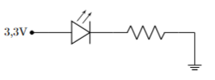
</p>
<p align="center">
  <em>Figura 3.2: Conexión de los LEDs.</em>
</p>

**Tabla 3.10: Conexiones de los LEDs**

| Nucleo | LED           |
| --------| ---------------|
| PB10   | LED-Alarm     |
| PB11   | LED-Bluetooth |
| PB2    | LED-ADULT     |
| PB1    | LED-KID       |


### 3.1.4 Costo de componentes

**Tabla 3.11: Costo de los componentes**

| Componente   | Costo [ARS] |
| --------------| -------|
| MAX30102     |   6239    |
| HM10         |    6630   |
| Display      |     7200  |
| Resistencias |     70  |
| LEDs         |     150  |
| Buzzer       |      1500 |
| Botones      |       1100 |


<sub>*Valores aproximados.</sub>

##  3.2 Firmware

### 3.2.1 Arquitectura general del firmware


<p align="center">
  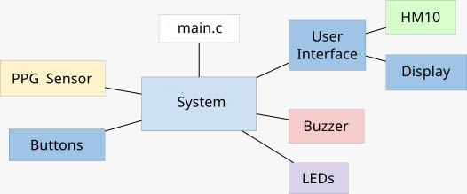
</p>
<p align="center">
  <em>Figura 3.3: Diagrama de módulos de software.</em>
</p>


<p align="center">
  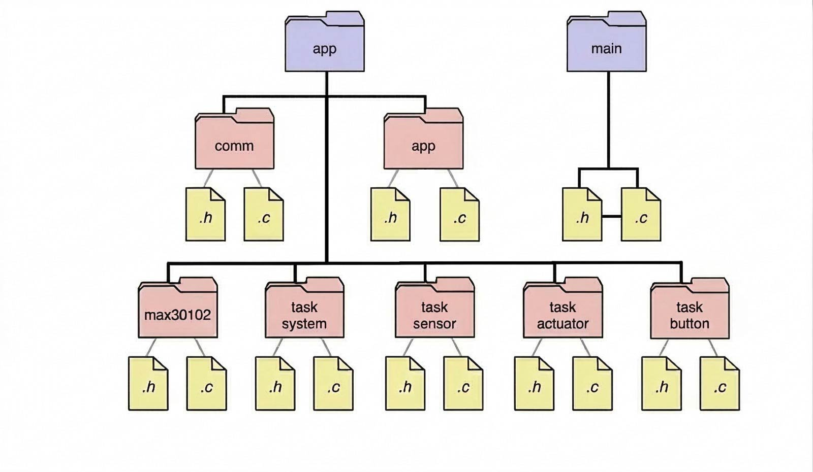
</p>
<p align="center">
  <em>Figura 3.4: Diagrama de archivos .h y .c.</em>
</p>

El diseño del firmware se basó en una arquitectura modular orientada a tareas, con el objetivo de desacoplar la lógica de control principal de la gestión específica de cada periférico de hardware, facilitando así el mantenimiento, la lectura y la escalabilidad del código.

Como se observa en la **Figura 3.3**, a nivel lógico, el núcleo del programa recae sobre el módulo central (<b>System</b>). Este actúa como coordinador: recibe y procesa la información proveniente de los periféricos de entrada (como el sensor PPG y los botones) y, en base a su máquina de estados, gestiona los periféricos de salida (interfaz de usuario, LEDs, buzzer y display) y la transmisión inalámbrica mediante el módulo HM-10.

A nivel de implementación, la **Figura 3.4** ilustra la organización de los archivos del proyecto. El código fuente se estructuró de manera jerárquica, separando claramente la aplicación principal, las rutinas de comunicación y las tareas dedicadas (`task_system`, `task_sensor`, `task_actuator`, `task_button`). Cada uno de estos módulos cuenta con su respectiva cabecera (`.h`) para la definición de las interfaces públicas y su archivo fuente (`.c`) para la implementación de la lógica privada, garantizando un correcto encapsulamiento.

**Tabla 3.12: Función de cada módulo de software.**

| Módulo | Funcionalidad | Rol |
| :--- | :--- | :--- |
| **Button** | Gestión de entradas físicas y filtrado de rebotes (*debouncing*). | Subsistema |
| **Sensor** | Coordinación de la adquisición periódica de datos. | Subsistema |
| **System** | Máquina de estados principal y coordinación general del equipo. | Sistema principal |
| **Actuator** | Control de periféricos de salida (LEDs y Buzzer). | Subsistema |
| **Comm** | Interfaz para el envío de datos al exterior (Bluetooth y Display). | Módulo de comunicación |
| **PPG_processing** | Algoritmos de filtrado digital y cálculo de parámetros fisiológicos. | Procesamiento de señal |
| **MAX30102** | Abstracción de hardware y manejo de registros vía I²C. | Driver |

---

### 3.2.2 Módulo Sensor

Este módulo representa un sensor que se comunica con un oxímetro de pulso (*MAX30102*), procesa la señal y guarda los valores obtenidos en la siguiente estructura de datos.

```C
        typedef struct {
            uint8_t heart_rate;
            uint8_t respiratory_rate;
            uint8_t spo2;
            uint8_t apnea;
            uint32_t timestamp;
        } task_sensor_results_dta_t;
```


<p align="center">
  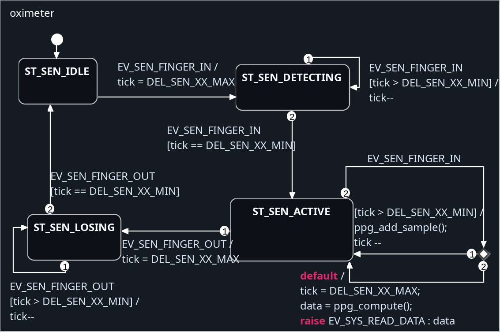
</p>
<p align="center">
  <em>Figura 3.6: Máquina de estados del sensor.</em>
</p>

El sistema comienza en el estado `ST_SEN_IDLE`.
En éste, el sensor se encuentra leyendo datos, y hasta no superar un umbral, se interpreta como la ausencia del dedo en el sensor.
Cuando el usuario coloca el dedo, la lectura supera el umbral y se genera el evento `EV_SEN_FINGER_IN`.

De forma similar al debouncing de un pulsador mecánico, se asegura que el dedo haya estado al menos cierta cantidad de ticks para confirmar que todas las lecturas corresponden a un usuario y no a ruido.
Para esto, se utilizan los estados intermedios `ST_SEN_DETECTING` y `ST_SEN_LOSING`.
En estos estados se asigna `DEL_SEN_XX_MAX` a la variable `tick` al entrar.
Mientras el sistema permanece en `ST_SEN_DETECTING`, el temporizador se va decrementando.
Si el dedo permanece colocado el tiempo mínimo requerido `DEL_SEN_XX_MIN`, el sistema pasa al estado `ST_SEN_ACTIVE` o `ST_SEN_IDLE` según desde cual transicione.

El estado `ST_SEN_ACTIVE` el sensor realiza las lecturas y ejecuta el procesamiento de la señal PPG con la función `ppg_compute()`.
La comunicación se realiza via $I^2C$ y en cada iteración se acceden los datos al buffer FIFO del MAX30102 para reconstruir la señal.
Una vez procesada, cada `DEL_SEN_MAX_TICKS` se accede a la interfaz del sistema y se actualiza la estructura de datos.
Además, activa una variable booleana indicando que el valor no ha sido leído.
De esta manera, _task_system_ puede hacer polling sin repetir el mismo dato.

---

### 3.2.3 Módulo Actuador

<p align="center">
  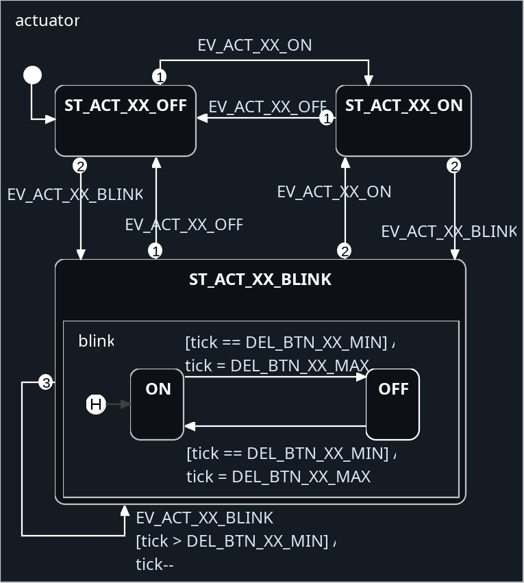
</p>
<p align="center">
  <em>Figura 3.8. Máquina de estados del actuador.</em>
</p>

Cada actuador cuenta con un identificador único representado con el siguiente enumerativo.

```C
/* Identifier of Task Actuator */
typedef enum {
    ID_LED_BLUETOOTH,
    ID_LED_KID,
    ID_LED_ADULT,
    ID_LED_ALARM,
    ID_BUZZER
} task_actuator_id_t;
```

De esta forma _task_actuator_ gestiona todos los actuadores del sistema con salidas simples (prendido, apagado o parpadeando).
En cada tick, éste itera sobre un arreglo de actuadores y actualiza el estado de cada uno según el evento que haya registrado cada uno.
Con una interfaz que evita exponer la implementación del conjunto de actuadores, _task_system_ puede asignarle un evento _ON_, _OFF_, o _BLINK_ pasandole el evento y el ID a la función

```C
void put_event_task_actuator(task_actuator_ev_t event, task_actuator_id_t identifier);
```

La función principal de cada actuador individual es controlar el comportamiento de los periféricos de salida del sistema (como los indicadores LED y el buzzer).

El sistema comienza por defecto en el estado `ST_ACT_XX_OFF`, lo cual representa que el actuador se encuentra completamente desactivado.
Desde este punto, si se recibe el evento `EV_ACT_XX_ON`, la máquina transiciona al estado `ST_ACT_XX_ON`, activando el hardware de forma continua.
Para volver a apagarlo, basta con generar el evento `EV_ACT_XX_OFF`, retornando al estado inicial.

Además de los estados estáticos, el sistema puede ingresar a un modo intermitente desencadenada por el evento `EV_ACT_XX_BLINK`.
Para modelar el parpadeo, se utilizan los estados `ST_ACT_BLINK_ON` y `ST_ACT_BLINK_OFF`.

Aunque el diagrama lo representa como un estado compuesto, el código lo modela como estados independientes entre los que se va alternando.
El paso de un sub-estado a otro está determinado por un temporizador interno (`tick`).
En cada iteración, el temporizador se decrementa continuo (`tick--`).
Cuando la variable alcanza su límite inferior (`[tick == DEL_BTN_XX_MIN]`), el actuador invierte su estado (pasando de `ON` a `OFF` o viceversa) y el temporizador se setea automáticamente a su cota superior (`tick = DEL_BTN_XX_MAX`).
Este ciclo se repite indefinidamente, generando la frecuencia de parpadeo deseada.
El actuador permanecerá en este ciclo de intermitencia hasta que reciba una orden explícita para detenerse: el evento `EV_ACT_XX_OFF` lo llevará nuevamente al estado de reposo, mientras que `EV_ACT_XX_ON` lo dejará encendido de manera permanente.


### 3.2.4 Módulo Botones

<p align="center">
  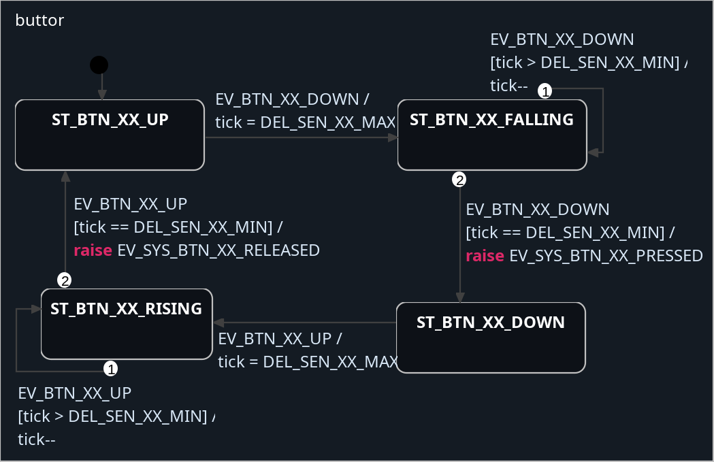
</p>
<p align="center">
  <em>Figura 3.7: Máquina de estados de los botones.</em>
</p>

La función principal de esta máquina de estados es detectar de forma segura la presión y liberación de los botones evitando lecturas incorrectas por rebotes mecánicos.

El sistema comienza en estado `ST_BTN_XX_UP`, el cual representa la condición en la cual el botón se encuentra sin presionar.
Cuando se detecta una transición del botón hacia el estado presionado(`EV_BTN_XX_DOWN`), EL SISTEMA PASA AL ESTADO `ST_BTN_XX_FALLING` e inicia un tick.
Dicho estado se utiliza para verificar que la presión del botón sea estable y no corresponda a un rebote.

Mientras el sistema permanece en `ST_BTN-XX_FALLING`, el temporizador se decrementa, si continua presionado durante un tiempo mínimo se considera que la presión fue válida y el sistema pasa a `ST_BTN-XX_DOWN`.
En ese momento se genera el evento `EV_SYS_BTN_XX_PRESSED`, que es enviado al sistema principal para indicar que el botón fue efectivamente presionado.

Cuando el usuario libera el botón (`EV_BTN_XX_UP`), el sistema pasa al estado `ST_BTN_XX_RISING`, donde nuevamente se utiliza el temporizador para confirmar que la liberación del botón sea estable.

Si el botón permanece liberado durante el tiempo mínimo establecido, el sistema retorna al estado `ST_BTN_XX_UP` y se genera el evento `EV_SYS_BTN_XX_RELEASED`, indicando al sistema que el botón fue liberado correctamente.

<!-- Esta forma de filtrar el ruido producido por el funcionamiento mecánico del pulsador, puede ser usado en otro tipo de entradas como el pin STATE del HM10, que indica si un dispositivo ya está conectado a bluetooth -->

---


### 3.2.5 Módulo Sistema

<p align="center">
  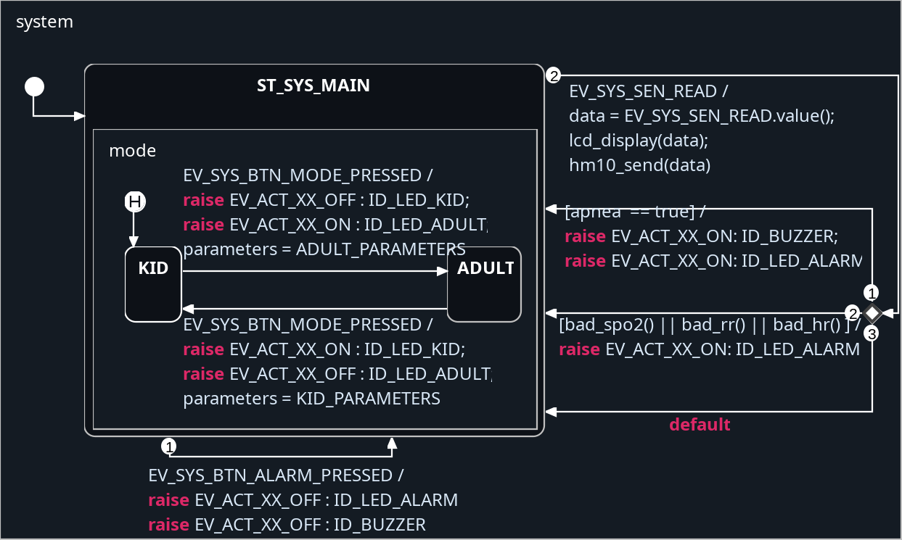
</p>
<p align="center">
  <em>Figura 3.5: Máquina de estados del sistema.</em>
</p>

Se observa en la figura 3.5, que _task_system_ se encarga de controlar el funcionamiento general del dispositivo.
Gestiona el modo de funcionamiento, la lectura de sensores, la persentación de la información, y el encendido o apagado de la alarma.

Cuenta con dos modos de funcionamiento: `KID` y `ADULT`, entre los cuales se alterna mediante un pulsador que desencadena el evento `EV_SYS_BTN_MODE_PRESSED`.
Por defecto el sistema se inicializa en modo `KID`.
El cambio de modo viene acompañado por el encendido del led correspondiente (`ID_LED_KID` O `ID_LED_ADULT` según el caso) asi como también del seteo de los parámetros correspondientes a ese modo.

Para poder gestionar la entrada de los botones sin perderse ninguna, cuenta con una interfaz conformada por una cola de eventos.
En cada iteración, _task_system_ pregunta si hay un evento.
Si no lo hay entonces no hace nada.
Por el contrario, si detecta un evento de botón presionado lo redirige al actuador.

Si el evento es `EV_SYS_SEN_READ` se realiza la lectura de los sensores.
Los datos obtenidos se muestran por pantalla y se envían por _UART_ al módulo bluetooth.
A partir de los parametros correspondientes al modo seleccionado, y los datos medidos, el sistema evalúa distintas condiciones de riesgo.
Si se detecta que alguno de los parametros fisiologicos se encuentra fuera de los valores normales el sistema también enciende el LED de alarma para advertir al usuario.
Además, si se determina que ocurre una situación de apnea, se activa el buzzer.

Finalmente, el usuario puede desactivar manualmente la alarma mediante el botón correspondiente, generando el evento `EV_SYS_BTN_ALARM_PRESSED`, el cual apaga el LED de alarma y el Buzzer.

### 3.2.6 Comm (Bluetooth)

Modela el comportamiento de un dispositivo que mantiene una conexión bluetooth con una aplicación móvil.
Se inicializa pasándole como parámetro la interfaz `UART` a utilizar.
Este módulo abstrae del uso de la _HAL_, la transmisión y recepción de datos con un dispositivo móvil por medio del HM10.

<!-- |Nombre | Tipo | Descripción | -->
<!-- | --- | --- | ---| -->
<!-- | hm10_init |   -->
<!---->


### 3.2.7 Display

Modela el uso de un display LCD de 16x2 en la modalidad de 4 pines.
Permite posicionar un cursor en cualquier parte de la pantalla y escribir una cadenas de texto.
Una función permite formatear la estructura de datos del sensor obtenidos por el sistema al tamaño del LCD utilizado en el proyecto.

---

## 3.2.3 Diseño de la placa

Se utilizó *KiCAD* durante la etapa de diseño, para preparar la pcb del
dispositivo.

<p align="center">
  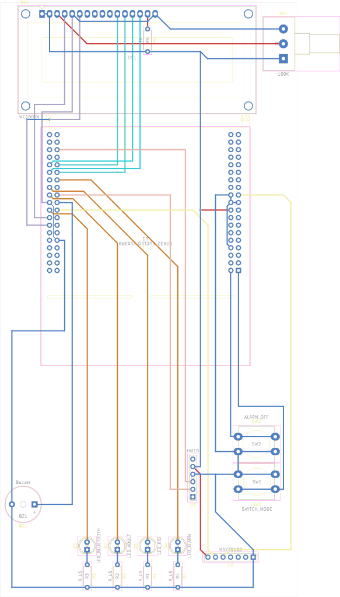
</p>
<p align="center">
  <em>Figura 3.10: Diseño de la PCB en KiCad.</em>
</p>

La disposición de la placa fue pensada para soldarse en una placa
experimental. Se representaron los cables como pistas y se tuvo en
cuenta el espaciado de los agujeros.

<p align="center">
  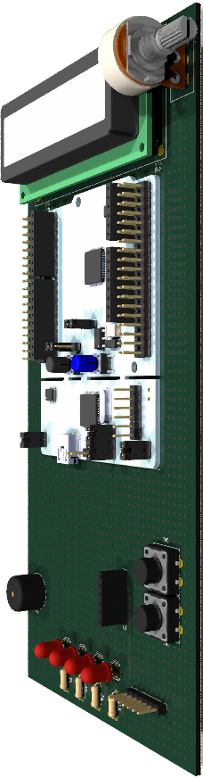
  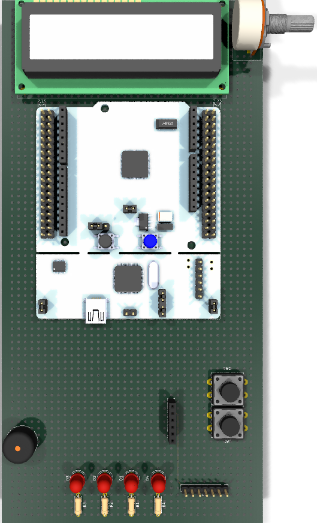
</p>
<p align="center">
  <em>Figura 3.11: Previsualización 3D de la placa.</em>
</p>


# 4 Ensayos y resultados
 
## 4.1 Pruebas funcionales del hardware

Con el objetivo de verificar el correcto funcionamiento de los
componentes físicos del sistema, se realizaron diversas pruebas
funcionales sobre el hardware desarrollado. Estas pruebas permitieron
validar la correcta operación de los módulos utilizados, así como la
integridad de las conexiones eléctricas entre los distintos dispositivos
que componen el sistema.

### 4.1.1 Metodología de ensayo

Las pruebas se realizaron verificando individualmente cada uno de los
módulos del sistema. En primer lugar, se comprobó el correcto suministro
de alimentación al circuito mediante una fuente USB, verificando las
tensiones presentes en los distintos puntos del sistema.

Posteriormente, se evaluó la comunicación I2C con el sensor MAX30102,
confirmando la correcta lectura de los registros del dispositivo y la
recepción de datos provenientes de la FIFO del sensor. Para validar el
funcionamiento del sensor óptico, se colocó el módulo en el dedo del
usuario y se observó la variación de la señal PPG adquirida.

Asimismo, se verificó el funcionamiento del módulo Bluetooth HM-10
mediante la transmisión de datos hacia una aplicación externa,
confirmando la correcta comunicación UART entre el microcontrolador y el
módulo inalámbrico.

Finalmente, se probaron los dispositivos de salida del sistema,
incluyendo los indicadores LED, el buzzer de alarma y el display,
verificando su activación ante distintos estados del sistema.

### 4.1.2 Resultados obtenidos

Durante los ensayos se comprobó el correcto funcionamiento de los
distintos módulos de hardware. La [Tabla 4.1](#tabla-hardware-tests)
resume los resultados obtenidos en las pruebas realizadas.

**Tabla 4.1: Pruebas funcionales de hardware.**

<table id="tabla-hardware-tests">
<tr>
<th>Componente</th>
<th>Prueba realizada</th>
<th>Resultado</th>
</tr>

<tr>
<td>Alimentación</td>
<td>Verificación de tensión de alimentación</td>
<td>Correcto</td>
</tr>

<tr>
<td>Sensor MAX30102</td>
<td>Comunicación I²C y lectura de registros</td>
<td>Correcto</td>
</tr>

<tr>
<td>Sensor MAX30102</td>
<td>Adquisición de señal PPG</td>
<td>Correcto</td>
</tr>

<tr>
<td>Bluetooth HM-10</td>
<td>Comunicación UART y transmisión de datos</td>
<td>Correcto</td>
</tr>

<tr>
<td>LEDs</td>
<td>Encendido según estado del sistema</td>
<td>Correcto</td>
</tr>

<tr>
<td>Buzzer</td>
<td>Activación ante condición crítica</td>
<td>Correcto</td>
</tr>

<tr>
<td>Display</td>
<td>Visualización de parámetros fisiológicos</td>
<td>Correcto</td>
</tr>

</table>


<p align="center">
  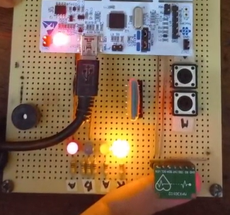
</p>
<p align="center">
  <em>Figura 4.1: LED indicadores en funcionamiento.</em>
</p>

<p align="center">
  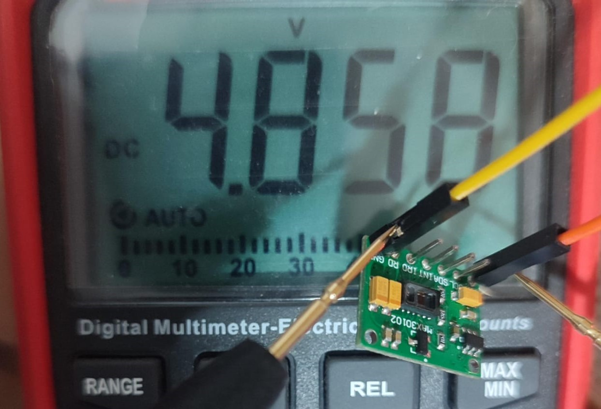
</p>
<p align="center">
  <em>Figura 4.2: Tensión del sensor MAX30102.</em>
</p>

### 4.1.3 Análisis de resultados

Los resultados obtenidos muestran que todos los módulos de hardware del
sistema funcionan correctamente y que las conexiones entre los distintos
dispositivos permiten una operación adecuada del sistema. La
comunicación con el sensor MAX30102 se realizó sin inconvenientes,
permitiendo la adquisición de las señales necesarias para el cálculo de
los parámetros fisiológicos.

Asimismo, la transmisión de datos mediante el módulo Bluetooth HM-10 se
llevó a cabo de forma estable, y los dispositivos de salida (LEDs,
buzzer y display) respondieron correctamente ante los diferentes estados
del sistema.

En base a estas pruebas, se concluye que el hardware del sistema se
encuentra en condiciones adecuadas para la ejecución del firmware y la
realización de las pruebas funcionales del software.

## 4.2 Pruebas funcionales del firmware

Con el objetivo de verificar el correcto funcionamiento del firmware
desarrollado, se realizaron distintos ensayos funcionales sobre el
sistema completo.

Durante los ensayos se evaluaron las principales funcionalidades del
sistema, incluyendo la adquisición de señales, el procesamiento de datos
fisiológicos, la detección de eventos críticos y la transmisión de
información.

### 4.2.1 Metodología de ensayo

Las pruebas se realizaron colocando el sensor óptico en el dedo del
usuario, permitiendo la adquisición de las señales infrarroja y roja
necesarias para los distintos calculos. El firmware ejecutó de manera
periódica las tareas de lectura del sensor, filtrado de la señal,
cálculo de parámetros fisiológicos y transmisión de los datos obtenidos.

Adicionalmente, se verificó el correcto funcionamiento de los
indicadores visuales y sonoros ante la detección de eventos críticos,
como disminuciones significativas en la saturación de oxígeno o
irregularidades en el patrón respiratorio y/o cardiaco.

### 4.2.2 Resultados obtenidos

Durante los ensayos se registraron los valores de $SpO_{2}$ y demas parametros estimados por el sistema. La [Tabla 4.2](#tabla-resultados-prueba)
presenta un conjunto representativo de las mediciones obtenidas.

**Tabla 4.2. Pruebas funcionales de firmware.**

<table id="tabla-resultados-prueba">

<tr>
<th>Muestra</th>
<th>SpO₂ (%)</th>
<th>Frecuencia respiratoria (rr)</th>
<th>Frecuencia cardíaca (hr)</th>
<th>Apnea</th>
</tr>

<tr>
<td>1</td>
<td>97</td>
<td>20</td>
<td>61</td>
<td>False</td>
</tr>

<tr>
<td>2</td>
<td>98</td>
<td>21</td>
<td>61</td>
<td>False</td>
</tr>

<tr>
<td>3</td>
<td>95</td>
<td>20</td>
<td>56</td>
<td>False</td>
</tr>

<tr>
<td>4</td>
<td>94</td>
<td>23</td>
<td>53</td>
<td>False</td>
</tr>

<tr>
<td>5</td>
<td>95</td>
<td>22</td>
<td>55</td>
<td>False</td>
</tr>

</table>


<p align="center">
  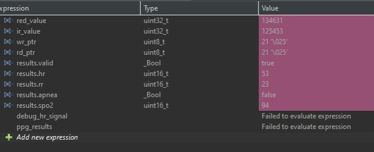
</p>
<p align="center">
  <em>Figura 4.3: Parametros fisiológicos vistos desde el debugger.</em>
</p>

<p align="center">
  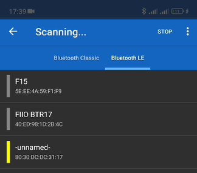
</p>
<p align="center">
  <em>Figura 4.4: Conexión exitosa con el módulo Bluetooth.</em>
</p>

### 4.2.3 Análisis de resultados

Los resultados obtenidos durante los ensayos muestran que el sistema es
capaz de adquirir y procesar correctamente las señales provenientes del
sensor óptico, permitiendo estimar los datos fisiologicos deseados.

Además, se verificó el correcto funcionamiento del sistema de
comunicación y de los mecanismos de alerta implementados. En general, el
comportamiento del firmware resultó consistente con los requerimientos
funcionales definidos previamente.

## 4.3 Pruebas de integración

**Tabla 4.3. Pruebas de integración**

| # | Caso de uso | Cumplido |
|---|-------------|----------|
| 1 | El usuario inicia el monitoreo del sueño y el dispositivo comienza a adquirir señales PPG del sensor MAX30102 para calcular los datos fisiológicos. | ✔ |
| 2 | El sistema monitorea continuamente los parámetros fisiológicos durante el sueño y transmite los valores de $SpO_{2}$ y respiración a la aplicación mediante Bluetooth. | ✔ |
| 3 | El sistema detecta una disminución crítica de $SpO_{2}$ o un episodio de apnea y activa una alarma sonora y visual para alertar al usuario. | ✔ |
| 4 | El usuario puede visualizar en tiempo real los parámetros fisiológicos en la aplicación o en el display del dispositivo. | ✔ |


<p align="center">
  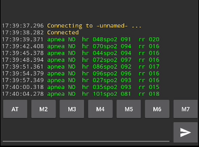
</p>
<p align="center">
  <em>Figura 4.5: Datos fisiológicos enviados a través de Bluetooth.</em>
</p>

<p align="center">
  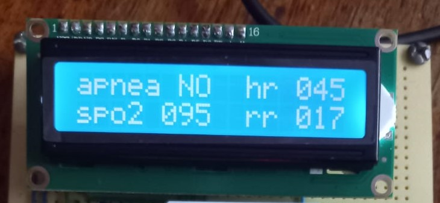
</p>
<p align="center">
  <em>Figura 4.6: Datos fisiológicos enviados a través del display.</em>
</p>

## 4.4 Cumplimiento de requisitos 

**Tabla 4.4. Requerimientos funcionales del sistema.**

| Estado | Descripción |
|---|---|
| 🟢 | Ya implementado |
| 🔴 | No implementado |


| Grupo | ID | Requerimiento Funcional | Descripción | Cumplido |
|------|----|------------------------|-------------|----------|
| Adquisición | 1.1 | Adquisición de señales | Capturar señales ópticas ROJO/IR del MAX30102 vía I²C. | 🟢 |
| Adquisición | 1.2 | Lectura periódica | Obtener muestras desde la FIFO del sensor. | 🟢 |
| Adquisición | 1.3 | Análisis de variación | Detectar variaciones relevantes para el cálculo de SpO₂ y respiración. | 🟢 |
| Procesamiento | 2.1 | Filtrado digital | Aplicar filtrado digital para reducir ruido en la señal PPG. | 🟢 |
| Procesamiento | 2.2 | Cálculo de SpO₂ | Calcular SpO₂ mediante el método del ratio R. | 🟢 |
| Procesamiento | 2.3 | Cálculo de respiración | Estimar la frecuencia respiratoria mediante análisis de envolvente o variaciones de línea base. | 🟢 |
| Procesamiento | 2.4 | Empaquetado de datos | Generar paquetes de datos con SpO₂, respiración y estado del sistema. | 🟢 |
| Indicadores | 3.1 | Alarma crítica | Activar alarma sonora cuando se detecta apnea. | 🟢 |
| Indicadores | 3.2 | Indicadores LED | Mostrar estados (crítico, normal, error) mediante LEDs. | 🟢 |
| Comunicación | 4.1 | Bluetooth | Transmitir datos vía HM-10 utilizando UART. | 🟢 |
| Comunicación | 4.2 | Envío de parámetros | Enviar SpO₂, respiración y estado del paciente a la aplicación. | 🟢 |
| Comunicación | 4.3 | Registro de eventos | Informar alarmas, desconexiones o estados especiales. | 🟢 |
| Comunicación | 4.4 | Elección de umbrales | Recibir umbrales y parámetros desde la aplicación. | 🔴 |
| Comunicación | 4.4 | Display | Mostrar parámetros fisiológicos relevantes en pantalla. | 🟢 |
| Memoria | 5.1 | Guardar configuración | Almacenar umbrales y parámetros en EEPROM. | 🔴 |
| Memoria | 5.2 | 	Restaurar valores |Recuperar valores predeterminados si hay error de memoria. | 🔴 |
| Alimentación | 6.1 | Alimentación | Alimentación del sistema mediante conexión USB. | 🟢 |
| Alimentación | 6.2 | Bajo consumo | Entrar en modo Sleep cuando no hay actividad. | 🔴 |
| Alimentación | 6.3 | Reactivación | Retomar actividad ante interrupciones o comandos. | 🟢 |


Los items no implementados ya fueron justificados anteriorimente en nuestro informe de avance.

## 4.5 Medición y análisis de consumo

### 4.5.1 Procedimiento realizado

La placa NUCLEO-F103RB permite medir el consumo del microcontrolador utilizando el jumper **JP6 (IDD)**.

Según el manual de usuario de la placa, el jumper JP6 puede retirarse para insertar un amperímetro en serie y medir la corriente consumida por el microcontrolador.

Funcionamiento del jumper:

| Estado del jumper | Descripción |
|---|---|
| JP6 conectado | El microcontrolador recibe alimentación normalmente |
| JP6 removido | Se puede conectar un amperímetro para medir el consumo |

Para realizar la medición se retira el jumper JP6 y se conecta un miliamperímetro entre los dos pines del conector. De esta manera se obtiene la corriente consumida por el STM32 durante la ejecución de la aplicación.

La potencia consumida se estimó mediante la expresión:

P = V * I

donde:

- **V** es la tensión de alimentación del sistema.
- **I** es la corriente medida en la línea de alimentación.


Esta medición permite analizar el consumo energético del sistema y evaluar el impacto de los modos.


---

### 4.5.2 Modos de operación medidos

Se realizaron mediciones del consumo del sistema bajo diferentes condiciones de funcionamiento, representativas del uso normal del dispositivo.

**Tabla 4.5: Consumo total medido del jumper J6 en distintos modos de operación.**
 
| Modo de operación | I pico @5 V [mA] | P pico @5 V [mW] | Observaciones |
|------------------|----------------|---------------|--------------|
| Sistema esperando dedo | 10,8 | 54 | Menor consumo, no se procesan datos |
| Sistema sensanso datos | 28,6 | 143 | |
| Sistema transmitiendo datos via Bluetooth | 32,4| 162 | |
| Sistema en estado de alarma (buzzer + LED) | 42,8| 214 | Mayor consumo, proceso de datos y actuadores |


---

### 4.5.3 Alcance de la medición

La medición realizada representa el **consumo total del sistema a la tensión de entrada de 5 V**.  
Los subsistemas alimentados a **3,3 V** quedan incluidos indirectamente en esta medición, dado que dicha tensión es generada mediante el regulador de la propia placa.

Por lo tanto, la corriente medida corresponde al consumo global del dispositivo completo en cada modo de funcionamiento.

---

El análisis de los resultados permite determinar el **consumo máximo del sistema**, correspondiente al caso del sistema en estado de alarma.


## 4.6 Medición y análisis de tiempos de ejecución (WCET)

### 4.6.1 Metodología aplicada

Con el objetivo de evaluar el desempeño temporal del sistema, se realizó un análisis del **tiempo de ejecución de las tareas principales**, determinando su **Worst Case Execution Time (WCET)**, es decir, el mayor tiempo observado durante múltiples ejecuciones.

La medición se realizó utilizando el **contador de ciclos del procesador (DWT – Data Watchpoint and Trace)** disponible en los microcontroladores ARM Cortex-M. Este contador permite registrar con alta precisión el número de ciclos de reloj transcurridos durante la ejecución de una sección de código.

El procedimiento consiste en:

1. Leer el valor del contador de ciclos antes de ejecutar la tarea.
2. Ejecutar la tarea o función a medir.
3. Leer nuevamente el contador al finalizar la ejecución.
4. Calcular la diferencia entre ambas lecturas para obtener el tiempo de ejecución.

El tiempo medido en ciclos se convierte a unidades de tiempo mediante la frecuencia de reloj del microcontrolador:

t = ciclos / f_CPU

donde:

- **ciclos**: número de ciclos de reloj medidos.
- **f_CPU**: frecuencia de operación del procesador.

---

## 4.6.2 Tareas analizadas

Se midieron los tiempos de ejecución de las principales tareas del sistema, responsables de la adquisición de datos, procesamiento de señal y comunicación.

**Tabla 4.6: Tareas principales del sistema analizadas para WCET.**

| Tarea | Archivo asociado | Descripción |
|------|------|------|
| task_sensor | task_sensor.c | Adquisición de datos desde el sensor |
| task_system | task_system.c | Control general del sistema |
| task_actuator | task_actuator.c | Control de actuadores (LED, buzzer) |
| task_button | task_button.c | Lectura de botones |


## 4.6.3 Resultados de medición

Los tiempos de ejecución se obtuvieron ejecutando cada tarea múltiples veces durante el funcionamiento normal del sistema y registrando el **máximo valor observado**.

**Tabla 4.7: Tiempos de ejecución medidos para las tareas del sistema.**

| Tarea | WCET [µs] | Período [ms] | Utilización |
|------|------|------|------|
| task_button | 22| 1 | 0,022|
| task_sensor | 879|1 | 0,879 |
| task_system |2536 |3000 |0,000845|
| task_actuator |30|1 | 0,03 |


Como se observa en la **Tabla 4.7**, para el análisis de la tarea `task_system` se utilizó su período real de ejecución (determinado por la cadencia de actualización de datos en la pantalla LCD, cada 3000 ms) en lugar del período de *polling* del planificador base (1 ms). Asumir la tasa de *polling* para una rutina asíncrona de baja frecuencia resultaría en un error analítico y en una sobreestimación matemática del factor de uso.

## 4.7 Cálculo del Factor de Uso (U) de la CPU

### 4.7.1 Método de cálculo

Con el objetivo de analizar la carga computacional del sistema, se estimó el **factor de uso del procesador (U)** a partir de los tiempos de ejecución de las tareas y sus respectivos períodos de activación.

El factor de uso se calcula mediante la expresión:

U = Σ (WCET_i / Periodo_i)

Dando como resultado <b>U = 0,933 = 93 %</b>

---

### 4.7.2 Interpretación del resultado

El valor total obtenido para **U** representa la fracción de tiempo en la cual el procesador se encuentra ejecutando tareas activas.

- Si **U < 1**, el sistema es temporalmente viable, ya que el procesador puede completar todas las tareas dentro de sus plazos.
- Si **U ≪ 1**, el procesador permanece ocioso durante una fracción significativa del tiempo.

En este sistema, se observa que el valor de **U** (93,3 %) se encuentra muy cercano al límite de la capacidad total del procesador. Esto indica que la CPU se mantiene fuertemente exigida y el margen de maniobra ante interrupciones asíncronas es mínimo. 

Como consecuencia directa de esta alta carga computacional, se descarta la implementación de modos de bajo consumo (como *Sleep* o *Wait For Interrupt*). Dado que el tiempo ocioso remanente es de apenas ~7 %, se estaria aportando un ahorro energético insignificante frente al riesgo de inestabilidad del sistema.

---

## 4.8 Console & Build Analyzer

Adjuntamos Captura de pantalla de **Console & Build Analyzer** luego de
compilar la versión final

<p align="center">
  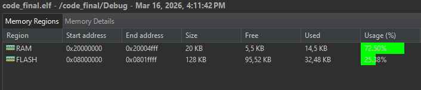
</p>
<p align="center">
  <em>Figura 4.7: Captura de memoria.</em>
</p>

<p align="center">
  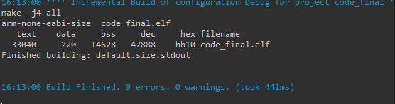
</p>
<p align="center">
  <em>Figura 4.8: Captura del compilador.</em>
</p>

Como se observa en la [Figura 4.7](#fig-memory-capture), el uso de memoria RAM del 72,5 % podría considerarse elevado. Sin embargo, este valor se debe principalmente al tamaño de la ventana de muestras utilizada para procesar los datos crudos del sensor MAX30102.

Reducir la frecuencia de muestreo o el tamaño de dicha ventana afectaría negativamente la calidad de los datos fisiológicos obtenidos, comprometiendo su validez. De hecho, en ciertas condiciones podría resultar incluso conveniente aumentar el tamaño de la ventana de procesamiento para mejorar la fidelidad de las mediciones.

## 4.9 Documentación del desarrollo realizado

En la **Tabla 4.8** se presenta un conjunto de elementos que resumen la
información más relevante acerca del diseño y la implementación del
sistema propuesto para la detección de apneas y variaciones en la
saturación de oxígeno durante el sueño.

A partir del análisis de estos elementos, es posible comprender los
principales aspectos del proyecto, incluyendo los objetivos del sistema,
su arquitectura de hardware y software, así como los resultados
obtenidos durante la etapa de implementación y evaluación.

**Tabla 4.8: Elementos que resumen la información más importante de "Sleep Centinel"**

| Elemento | Referencia |
|----------|------------|
| Justificación y objetivos del proyecto | Sección [1](#1-introduccion-general) |
| Requisitos funcionales y no funcionales del sistema | Sección  [2](#2-introduccion-especifica) |
| Casos de uso del sistema | Sección [2](#2-introduccion-especifica) |
| Arquitectura de hardware del dispositivo | Sección [3](#3-diseno-e-implementacion) |
| Diagrama de conexiones entre los componentes del sistema | Sección [3](#3-diseno-e-implementacion) |
| Arquitectura del software del sistema embebido | Sección [3](#3-diseno-e-implementacion) |
| Evaluación del cumplimiento de los requisitos del sistema | Sección [4](#4-ensayos-y-resultados) |
| Evaluación del consumo | Sección [4](#4-ensayos-y-resultados) |
| Propuestas de mejoras o trabajos futuros | Sección [5](#5-conclusiones) |
| Video demostrativo | Apéndice [A](#a-video) |
| Conclusiones finales | Sección [5](#5-conclusiones)|


# 5 Conclusiones

El desarrollo del trabajo "Sleep Centinel" ha permitido consolidar la integración de hardware y software en un sistema embebido orientado a la salud, logrando diseñar e implementar exitosamente un dispositivo portátil capaz de monitorizar señales vitales de forma continua.

## 5.1 Resultados

Las pruebas funcionales y de integración confirmaron que el dispositivo cumple satisfactoriamente con los requerimientos de adquisición, procesamiento y transmisión de datos. Se obtuvo una estimación aceptable y consistente de los parámetros fisiológicos (SpO₂, frecuencia cardíaca y respiratoria) a partir de la señal PPG obtenida por el sensor MAX30102, validando el correcto desempeño de los algoritmos de procesamiento digital implementados.

Adicionalmente, se comprobó la robustez de la arquitectura de firmware basada en máquinas de estado. Esta estructura permitió gestionar de forma eficiente la interacción del sistema, asegurando una correcta transición entre los modos de operación (Adulto y Niño) y un manejo adecuado de las entradas físicas mediante el filtrado por software de los pulsadores. 

Los enlaces de comunicación (I²C para el sensor y UART para el módulo Bluetooth) operaron de manera estable durante los ensayos. Esto garantizó la fluidez en la visualización de los parámetros en tiempo real, tanto en el display LCD como en el dispositivo móvil, asegurando a su vez la respuesta oportuna del sistema de alarmas locales ante la detección de anomalías o desaturaciones.

Por último, cabe destacar cómo la asistencia de herramientas de Inteligencia Artificial (IA) ayudó en diversos aspectos del desarrollo:

- Asistencia en la redacción y depuración de código.
- Corrección de ortografía, gramática y estilo del documento.
- Generación de recursos visuales (imágenes y videos).
- Asistencia en el diseño y validación de la lógica de las máquinas de estado.
- Asistencia en el uso de herramientas de control de versiones (Git y GitHub)

## 5.2 Próximos pasos

A partir de los resultados obtenidos y la arquitectura planteada, se identifican diversas oportunidades de mejora para futuras iteraciones del proyecto:

- **Optimización del procesamiento:** Refinar los algoritmos de filtrado digital y cálculo de señales para reducir el factor de uso del procesador. Disminuir la carga computacional permitiría eventualmente habilitar modos de bajo consumo de forma segura.
- **Autonomía y miniaturización:** Aprovechar el espacio disponible en el diseño actual de la PCB para desarrollar un modelo más compacto mediante componentes de montaje superficial (SMD) e integrar un circuito de gestión de batería (BMS) con una celda de litio, haciendo al dispositivo verdaderamente portátil.
- **Almacenamiento local:** Incorporar un módulo para tarjeta micro SD o aprovechar la memoria flash interna para registrar un histórico local de las mediciones. Esto evitaría la pérdida de datos durante la noche frente a posibles desconexiones del módulo Bluetooth.
- **Desarrollo de aplicación nativa:** Reemplazar el uso de terminales seriales genéricas por una aplicación móvil dedicada que reciba los paquetes de datos, genere reportes históricos de los episodios de apnea y ofrezca una interfaz gráfica más amigable para el usuario final.
- **Diseño de pinza sensitiva:** Incorporar el sensor óptico en una pinza o broche independiente del nucleo principal, para que el usuario pueda permanecer alejado del monitor y descansar de forma cómoda y natural.

---

# Referencias

1. National Institutes of Health (NIH) – Sleep Apnea Fact Sheet. Disponible en: https://www.nhlbi.nih.gov/health/sleep-apnea
2. Sally K. Longmore et al., “A Comparison of Reflective Photoplethysmography for Detection of Heart Rate, Blood Oxygen Saturation, and Respiration Rate at Various Anatomical Locations”, *Sensors*, vol. 19, no. 8, 1874, Apr. 2019. Disponible en: https://www.mdpi.com/1424-8220/19/8/1874
3. Park J., Seok H. S., Kim S. S., & Shin H. (2022). *Photoplethysmogram Analysis and Applications: An Integrative Review*. Frontiers in Physiology, 12, Article 808451. doi:10.3389/fphys.2021.808451. Disponible en: https://www.ncbi.nlm.nih.gov/pmc/articles/PMC8920970/ 
4. MAX30102 – Pulse Oximeter and Heart-Rate Sensor Datasheet. Maxim Integrated. Disponible en: https://datasheets.maximintegrated.com/en/ds/MAX30102.pdf
5. Ariel Lutenberg, Pablo Gomez, & Eric Pernia. *A Beginner's Guide to Designing Embedded System Applications on Arm Cortex-M Microcontrollers*. Arm Education Media. Disponible en: https://armkeil.blob.core.windows.net/developer/Files/pdf/ebook/arm-designing-embedded-system-application-cortex-m.pdf
6. Manual de usuario de la placa NUCLEO-F103RB. STMicroelectronics. Disponible en: https://www.st.com/en/evaluation-tools/nucleo-f103rb.html
---


# Apéndice A. Video
https://www.youtube.com/watch?v=pGM0ltA05JQ

